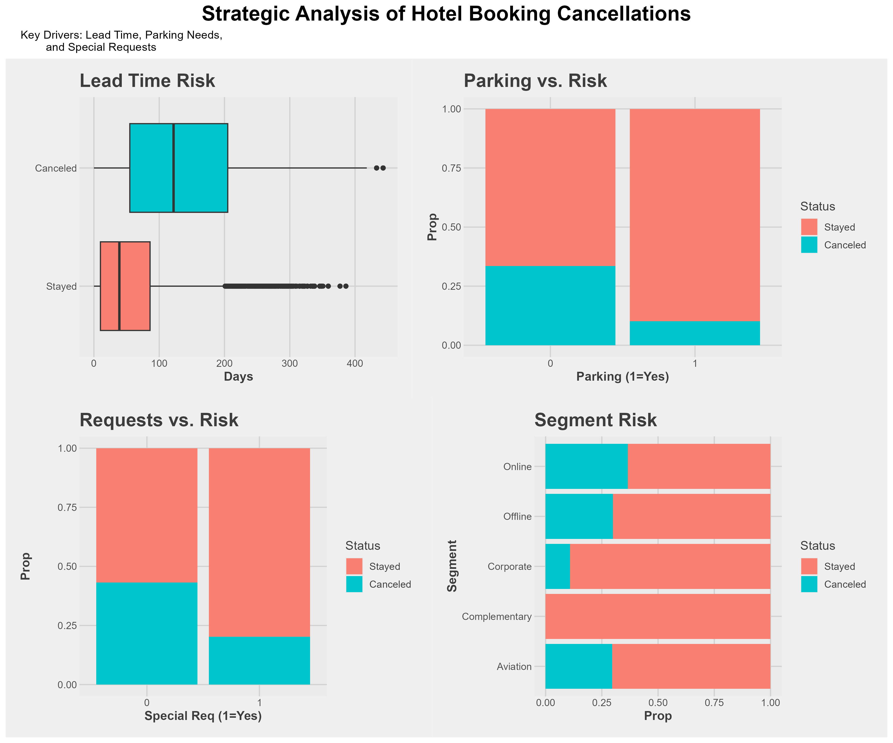

# Hotel Booking Cancellation Analysis 🏨
*Predictive Modeling to Optimize Revenue and Operations*

## 📊 Project Dashboard

## 🎯 The Problem
High cancellation rates disrupt hotel operations, leading to lost revenue and inefficient staffing. This project identifies key "behavioral anchors" to predict guest check-ins versus cancellations.

## 💡 Key Business Insights
* **The Power of Commitment:** Guests requesting parking are **79% less likely** to cancel.
* **Engagement as Glue:** Each special request reduces cancellation odds by **68%**.
* **Lead Time Risk:** Risk increases by **1.6%** per day of lead time, suggesting the need for stricter deposit policies for long-term bookings.

## 🛠️ Technical Achievements
* **Accuracy:** 80.6%
* **Balanced Strategy:** Tuned to a **0.42 threshold** for an F1-Score of 0.71.
* **Stack:** R (tidyverse, patchwork, caret, kableExtra)
